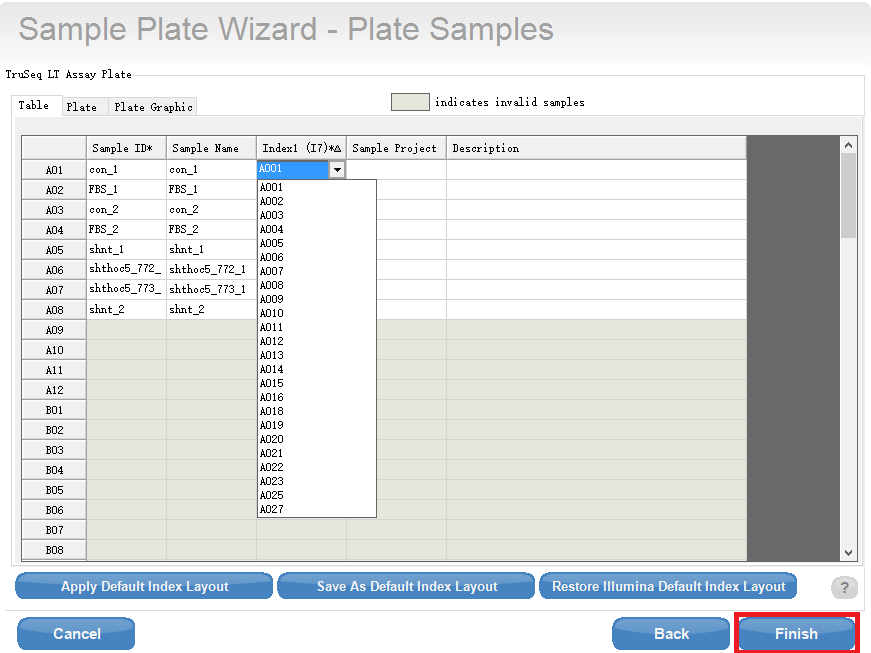

fi#Pre-process raw sequencing data and submit fastq files to server

Usually one sequencing run is composed of a group of samples (e.g. 24). Each sample has a unique index. So the first step of data 
processing is to demultiplex samples.

Illumina supplies a tool bcl2fastq2 to do the job. It could demultiplex and trim adaptors simutaneously. 
You need to prepare a SampleSheet.csv file. Firstly install Illumina Expriment Manager (IEM) on your computer.

**1) After opening IEM, choose "Create Sample Sheet" -> "NextSeq" -> "NextSeq Fastq Only"**


Parameters:
*Regent kit barcode: e.g. 15025063, check the vendor package
*Lirary Prep kit: e.g. TrueSeq LT
*Index read: 0,1 or 2 (no index, single-end and pair-end)
*Experiment Name
*Investigator Name
*Description
*Read Type: SE or PE
*Cycles Read 1: length of read1
*Cycles Read 2: length of read2

**2) In the next page, select "New Plate" and input Plate Name.**


Fill in Sample ID, Sample Name. Select right Index number e.g. A001. The software will automatically fill sequence of index later.
Finish and save the plate file.


   
**3) Create SampleSheet**

After filling Plate Information, select all samples and add them to sample table.


**4) Lastly, save the sample file as "SampleSheet.csv".**

**5) Run bcl2fastq**

  Upload the  to the raw data directory, e.g. 170203_NB501912_0002_AH3VJNBGX2, and run the command.
  
  ```
  bcl2fastq --ignore-missing-bcls --ignore-missing-filter --ignore-missing-positions --no-lane-splitting

  ```
  
  **Final Results**
  
  **The demultiplexed and adaptor-trimmed fastq files would be found under the directory of Data/Intensities/BaseCalls**
  
  
   :+1: This PR looks great - it's ready to merge! :shipit:
